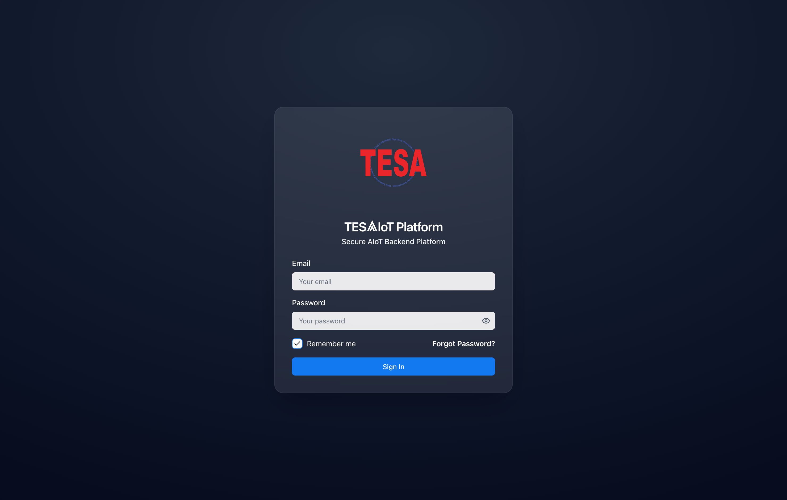
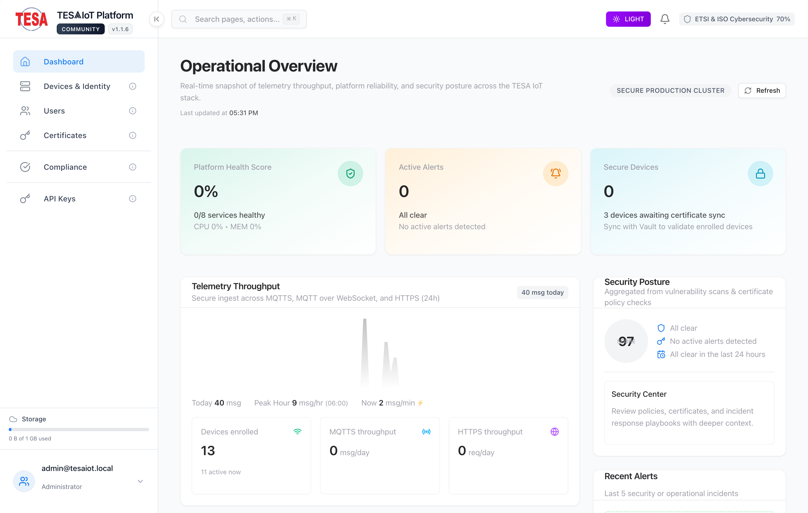
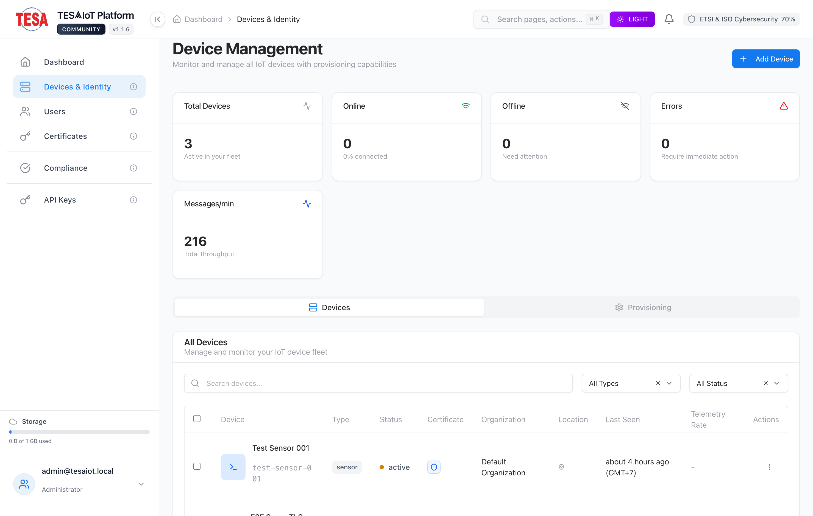
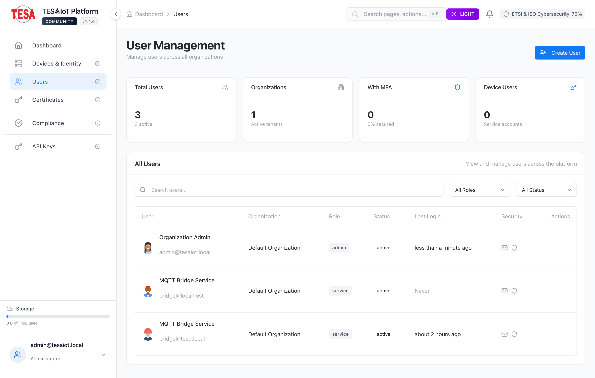
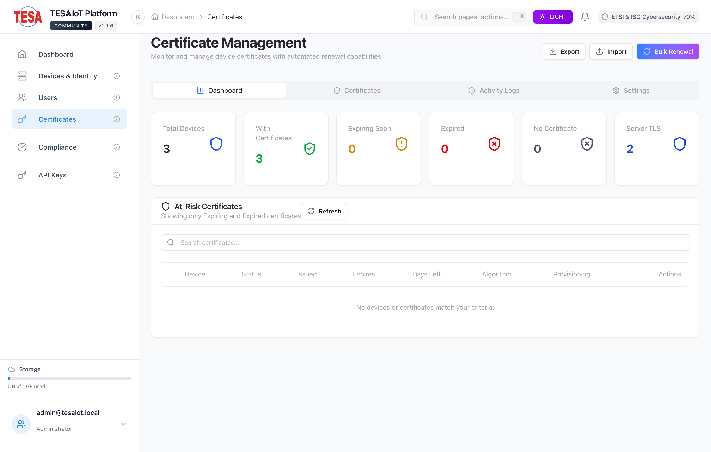
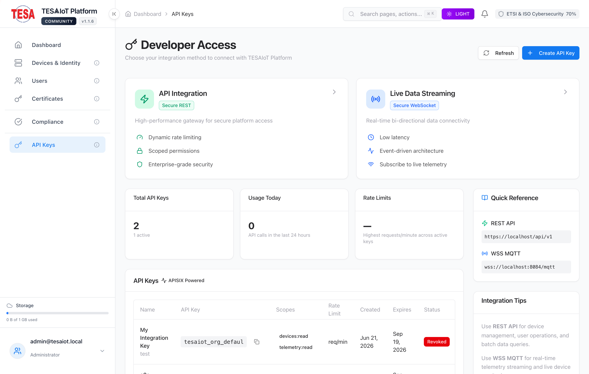
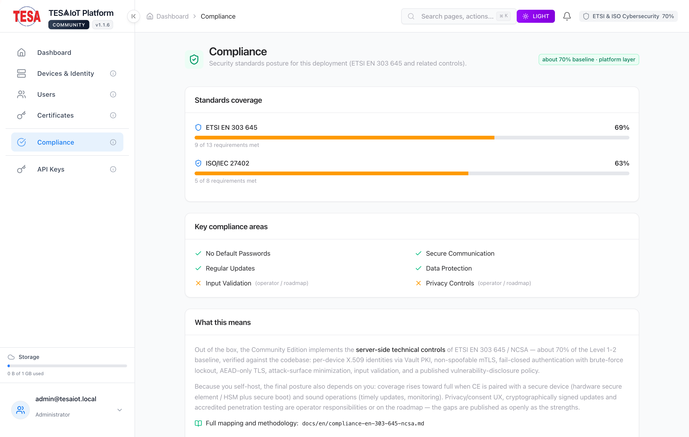
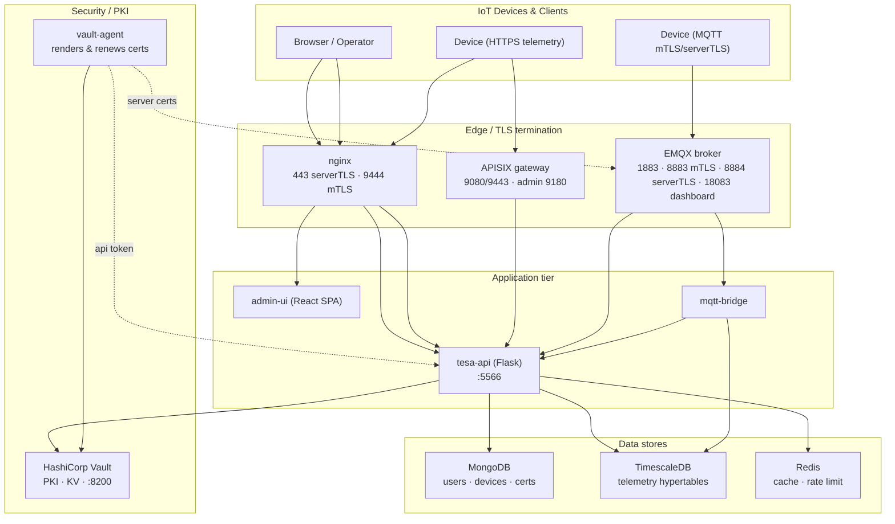

<!--
SPDX-License-Identifier: Apache-2.0
Copyright TESAIoT Platform contributors
-->

# TESAIoT Community Edition

**A self-hosted, single-organization, Apache-2.0 licensed secure IoT platform.**

TESAIoT Community Edition is an extracted, hardened subset of the full
[TESAIoT Secure IoT Platform](#about-this-distribution). It gives a single
organization everything needed to onboard devices, authenticate them with
real X.509 certificates from a private PKI, ingest telemetry over MQTT and
HTTPS, and watch it live — all running on one Docker host.

<!-- Badge placeholders — wire these up when the repo goes public -->


<!--  -->
<!--  -->
<!--  -->

---

## What it does

The Community Edition ships **exactly eight capabilities** — no more, no less:

| # | Capability | What you get |
|---|------------|--------------|
| 1 | **User Management** | Bootstrap admin, user CRUD, JWT auth, bcrypt password hashing, optional email/OTP. |
| 2 | **Device / Identity Management** | Register devices, bind them to certificates, manage their MQTT/telemetry identity. |
| 3 | **serverTLS & mTLS authentication** | Two device transport modes — server-only TLS (username/password over TLS) and mutual TLS (client certificate required). |
| 4 | **Certificate life-cycle via Vault PKI** | Issue, renew and revoke device & service certificates from a two-tier HashiCorp Vault PKI (root → intermediate). |
| 5 | **APISIX API Gateway** | Edge gateway with API-key auth, route-level rate limiting (`limit-req`) and serverTLS/mTLS termination (standalone YAML mode, no etcd). |
| 6 | **EMQX MQTT Broker** | Production MQTT 5 broker with plain/serverTLS/mTLS listeners and webhook-delegated auth/ACL. |
| 7 | **MongoDB & TimescaleDB** | MongoDB for users/devices/certs registry; TimescaleDB for time-series telemetry. |
| 8 | **IoT Telemetry Dashboard** | The live telemetry view inside **Device Details** in the Admin UI. |

**Not included (by design):** multi-tenancy / multiple organizations, AI inference,
OTA / firmware update, B2B / WebSocket features, BENTO IDE, Developer Hub, summit
sites, analytics module, and the Grafana/Prometheus monitoring stack. See the
[full documentation](docs/en/) for details.

---

## Screens

A quick tour of the admin UI (single-organization Community Edition).

### Sign in
Email + password authentication (bcrypt) for the single organization; the
first-run admin is seeded from `ADMIN_EMAIL` / `ADMIN_PASSWORD`.



### Dashboard — Operational Overview
Real-time snapshot of telemetry throughput, platform reliability and security
posture: platform health score, active alerts, secure-device certificate sync,
MQTTS / MQTT-over-WS / HTTPS ingest rates, and an aggregated security score.



### Devices & Identity
Register devices and bind them to real X.509 identities; choose **serverTLS** or
**mTLS**, track certificate status, and view each device's live telemetry.



### Users
Local user accounts, roles and JWT authentication for the single organization
(bcrypt password hashing, optional email/OTP).



### Certificates
Issue, renew and revoke device & service certificates from the two-tier
HashiCorp Vault PKI (root → intermediate).



### API Keys — Developer Access
Issue, scope, rotate and revoke organization API keys for the REST API / gateway,
with per-key rate limits and usage. Keys are stored as a hash + prefix and shown
in full exactly once.



### Compliance
The deployment's standards posture — ETSI EN 303 645 and ISO/IEC 27402 — about
the **70% baseline** the Community Edition ships at the platform layer, with the
remaining operator/roadmap items published as openly as the strengths.



---

## Architecture



```
                         +-------------------+
  Browser / Operator --> |  nginx  :443/:9444|  serverTLS + mTLS termination
                         +---------+---------+
                                   |
        +--------------------------+--------------------------+
        |                          |                          |
   +----v----+              +------v------+            +------v------+
   | admin-ui|              |  tesa-api   |<-----------|   APISIX    |  API-key gateway
   | (React) |              | Flask :5566 |   /api/*   |  :9080/9443 |
   +---------+              +--+--+--+--+-+            +-------------+
                              |  |  |  |
        +---------------------+  |  |  +----------------------+
        |               +-------+  +-------+                  |
   +----v----+     +-----v-----+        +--v-----+      +-----v-----+
   | MongoDB |     |TimescaleDB|        | Redis  |      |   Vault   | PKI + KV
   | :27017  |     |   :5432   |        | :6379  |      |   :8200   |
   +---------+     +-----------+        +--------+      +-----+-----+
                                                             |
   IoT devices --MQTT--> EMQX :8883(mTLS)/:8884(serverTLS) --+ (vault-agent renews certs)
                          |
                          +--> mqtt-bridge --> tesa-api --> TimescaleDB
```

**11 containers:** `vault`, `vault-agent`, `mongodb`, `timescaledb`, `redis`,
`api`, `admin-ui`, `emqx`, `mqtt-bridge`, `nginx`, `apisix`.
APISIX runs in standalone YAML mode, so **etcd is not required**.

---

## Quickstart

> Requires a 64-bit host with Docker Engine + the Docker Compose v2 plugin,
> `openssl`, `python3`, and `curl`. Runs on Linux and on **Docker Desktop**
> (macOS — Intel and Apple Silicon — and Windows/WSL 2); all images are
> multi-arch. See [docs/en/installation.md](docs/en/installation.md) for full
> prerequisites and server sizing.

```bash
# 1. Clone
git clone <your-fork-url> tesaiot-community-edition
cd tesaiot-community-edition

# 2. One-command bootstrap (generates secrets, brings the stack up)

#    Fast path — pull the pre-built, multi-arch images (ghcr.io/tesaiot/…):
make install PREBUILT=1

#    …or build everything from source instead (contributors, customizing, or
#    air-gapped). This is also the automatic fallback when images are not
#    available:
#    make install

#    Optionally bind a public domain on first run (either path):
#    make install PREBUILT=1 DOMAIN=iot.example.com

# 3. Watch it come up
make health
```

`make install` runs: preflight → generate secrets + first-run TLS →
**build from source** (or **`PREBUILT=1`** to pull the pre-built images) →
start infra → init Vault PKI → start vault-agent → init databases → start the
app tier → provision EMQX + APISIX → health check.

> Only three images are TESAIoT-authored (`api`, `admin-ui`, `mqtt-bridge`) and
> published to GHCR on each release; the rest are upstream images. Either path
> produces an identical stack — the Dockerfiles are public, so a pre-built image
> is just a build you didn't have to wait for.

When it finishes it prints the URLs and reminds you that the bootstrap admin
login is `ADMIN_EMAIL` / `ADMIN_PASSWORD` from your generated `.env`.

### Default endpoints

| Service | URL |
|---------|-----|
| Admin UI + Telemetry Dashboard | `https://localhost/` (nginx :443) |
| REST API | `https://localhost/api/v1/` (`:5566` is internal-only — deliberately not published on the host) |
| IoT mTLS telemetry ingest | `https://localhost:9444/` |
| APISIX gateway | `http://localhost:9080` (admin `:9180`, https `:9443`) |
| EMQX dashboard | `http://localhost:18083` (user `admin`) |
| EMQX MQTT | `:1883` plain · `:8883` mTLS · `:8884` serverTLS · `:8083/:8084` WS/WSS |
| Vault UI | `http://localhost:8200/ui` |

> The first-run certificates are **self-signed** — your browser will warn until
> you switch to Vault-PKI-issued or Let's Encrypt certs. See
> [docs/en/security-tls-mtls.md](docs/en/security-tls-mtls.md).

### Manual / step-by-step

Prefer to drive it yourself? Use the Makefile targets. **Order matters**:
Vault must be up and its PKI initialised *before* the rest of the stack —
vault-agent (and therefore the api's `depends_on`) waits on AppRole
credentials that only `make init-pki` creates:

```bash
make preflight                # check host prerequisites
make secrets                  # write .env + mongo keyfile + first-run TLS + rendered configs
make build                    # build images from source  (or: make pull — pre-built images)
docker compose up -d vault    # start Vault FIRST
make init-pki                 # initialise + unseal Vault, build the PKI hierarchy
make up                       # now start the rest of the stack
make init-db                  # MongoDB replica set + TimescaleDB hypertable
make init-emqx                # provision the internal bridge user
make init-apisix              # sync the admin key + verify routes
make health                   # status table
```

Run `make help` to see every target.

---

## Documentation

Full English docs live in [`docs/en/`](docs/en/):

| Guide | Covers |
|-------|--------|
| [installation.md](docs/en/installation.md) | Prerequisites, sizing, install Docker, configure, first login, verify. |
| [verification.md](docs/en/verification.md) | First login, health check, `make smoke` end-to-end test, per-service checks. |
| [configuration.md](docs/en/configuration.md) | Every `.env` variable, config files, domain wiring. |
| [architecture.md](docs/en/architecture.md) | Components, networks, data flow, ports. |
| [security-tls-mtls.md](docs/en/security-tls-mtls.md) | serverTLS vs mTLS, the device cert flow. |
| [certificate-lifecycle.md](docs/en/certificate-lifecycle.md) | Vault PKI issue / renew / revoke. |
| [user-management.md](docs/en/user-management.md) | Users, roles, auth, OTP. |
| [device-management.md](docs/en/device-management.md) | Register & manage devices and identities. |
| [api-gateway-apisix.md](docs/en/api-gateway-apisix.md) | APISIX routes, consumers, rate limits. |
| [mqtt-emqx.md](docs/en/mqtt-emqx.md) | EMQX listeners, auth webhook, ACL, bridge. |
| [telemetry-dashboard.md](docs/en/telemetry-dashboard.md) | The dashboard inside Device Details. |
| [backup-restore.md](docs/en/backup-restore.md) | Back up & restore data + secrets. |
| [troubleshooting.md](docs/en/troubleshooting.md) | Common problems and fixes. |
| [upgrade.md](docs/en/upgrade.md) | Upgrading between versions safely. |

---

## Support & contributing

- **Questions:** see [SUPPORT.md](SUPPORT.md) (if present) or open a Discussion.
- **Bugs / features:** open an issue using the templates in `.github/ISSUE_TEMPLATE/`.
- **Security:** **do not** open a public issue — follow [SECURITY.md](SECURITY.md).
- **Contributing:** read [CONTRIBUTING.md](CONTRIBUTING.md) and the
  [CODE_OF_CONDUCT.md](CODE_OF_CONDUCT.md).
- **Our open-source stance:** read [PRINCIPLES.md](PRINCIPLES.md) — what is free,
  what we protect and why, and where any revenue goes. Using TESAIoT? You are
  welcome to add your organization to [ADOPTERS.md](ADOPTERS.md).

---

## About this distribution

TESAIoT Community Edition v1.0.0 is an Apache-2.0 relicensing of an extracted,
single-organization subset of the TESAIoT Secure IoT Platform, released by the
platform's owner. See [`LICENSE`](LICENSE) for the full Apache License 2.0 text
and [`NOTICE`](NOTICE) for attribution and origin. Changes are tracked in
[`CHANGELOG.md`](CHANGELOG.md) following [Keep a Changelog](https://keepachangelog.com)
and [Semantic Versioning](https://semver.org).

The code is Apache-2.0; the **TESAIoT name and marks** are stewarded by TESA for
everyone who relies on them — see [`PRINCIPLES.md`](PRINCIPLES.md) for our stance
and [`TRADEMARK.md`](TRADEMARK.md) for simple, friendly brand guidelines (the
answer to "may we use the name?" is almost always yes).
