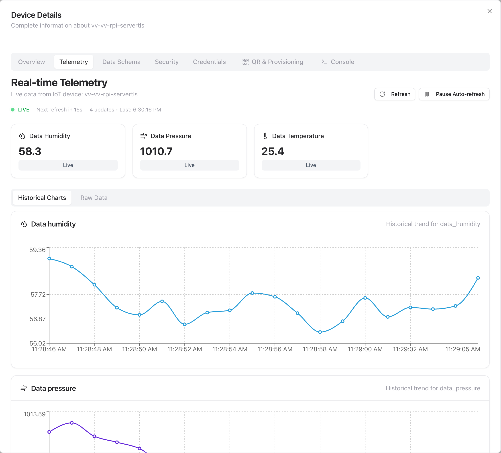
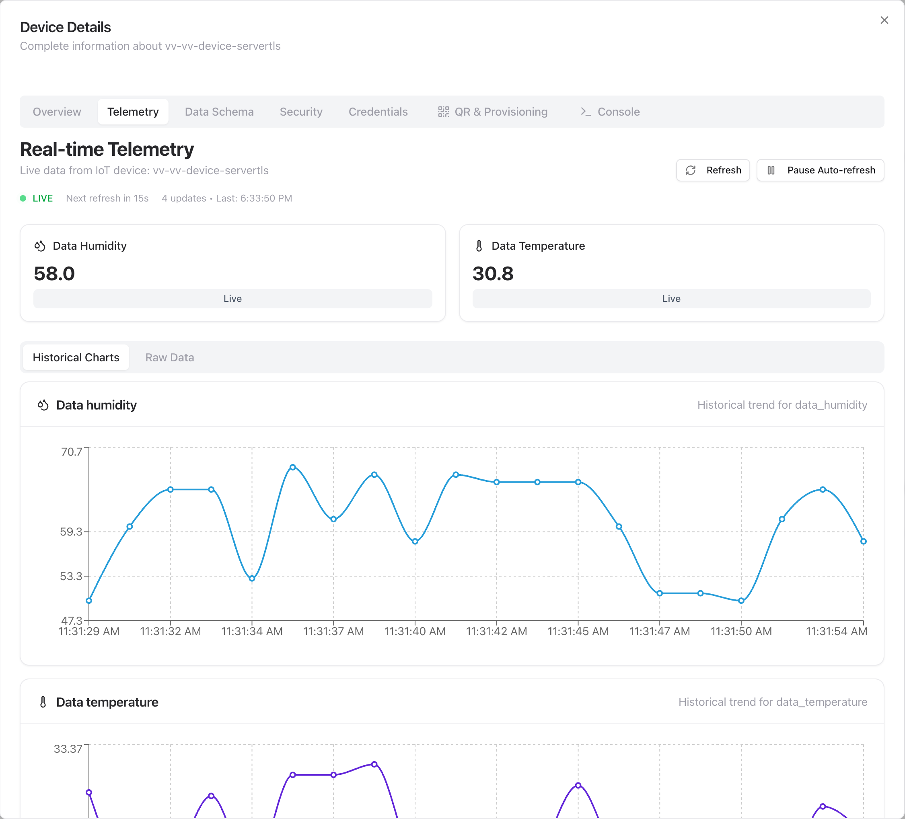
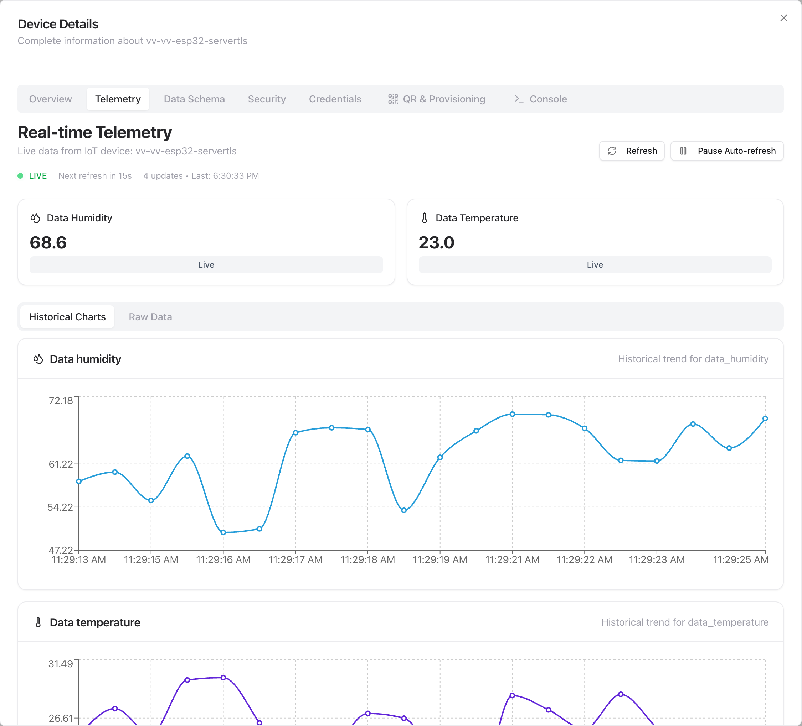
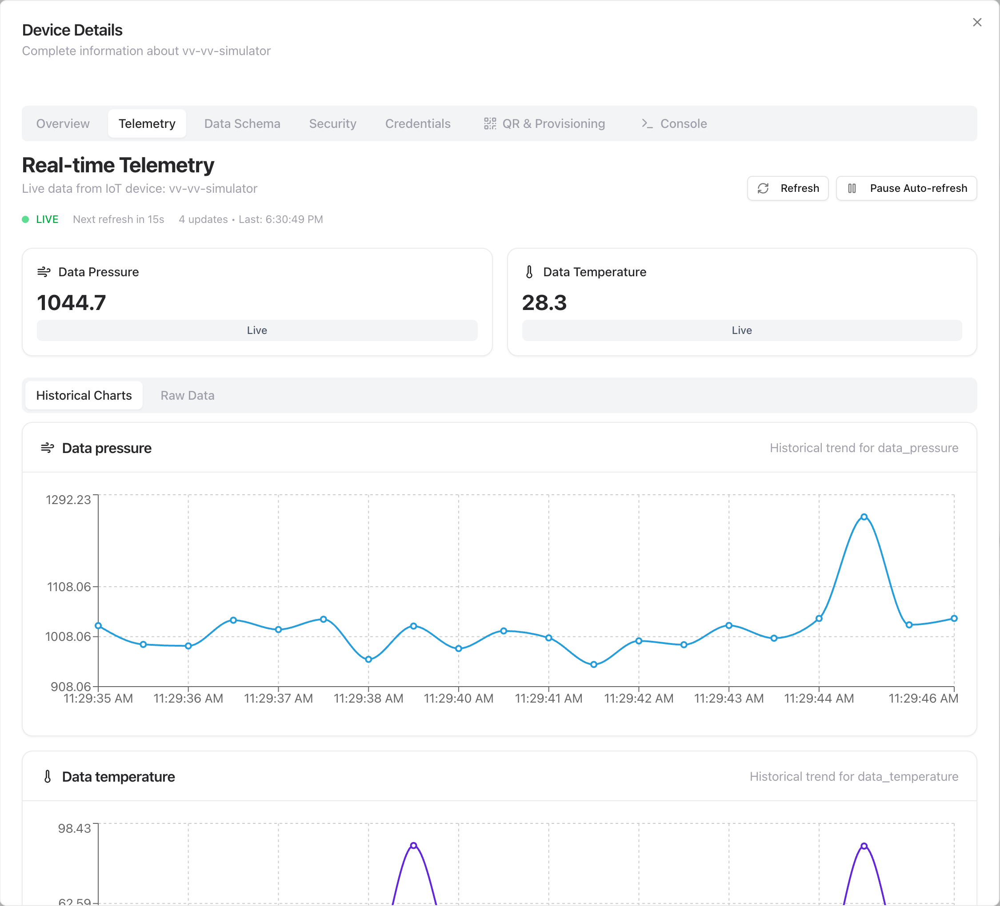
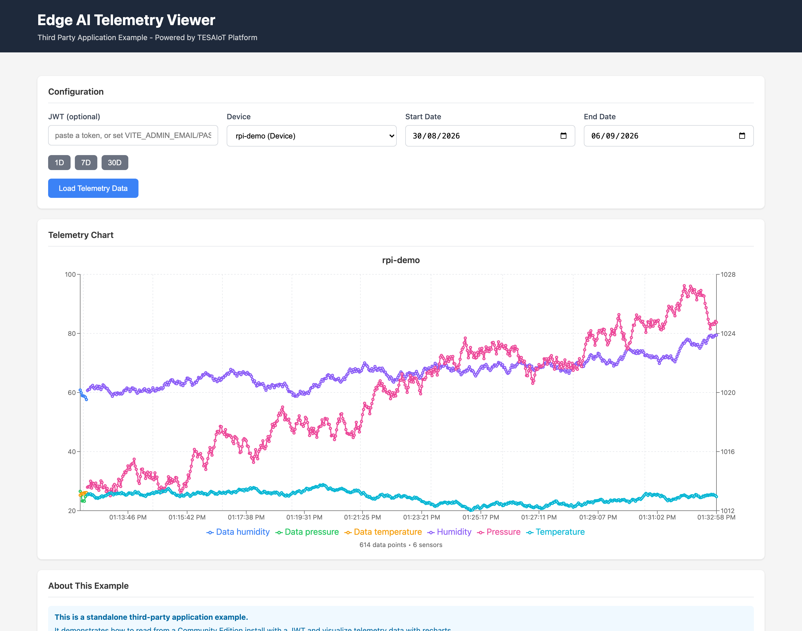
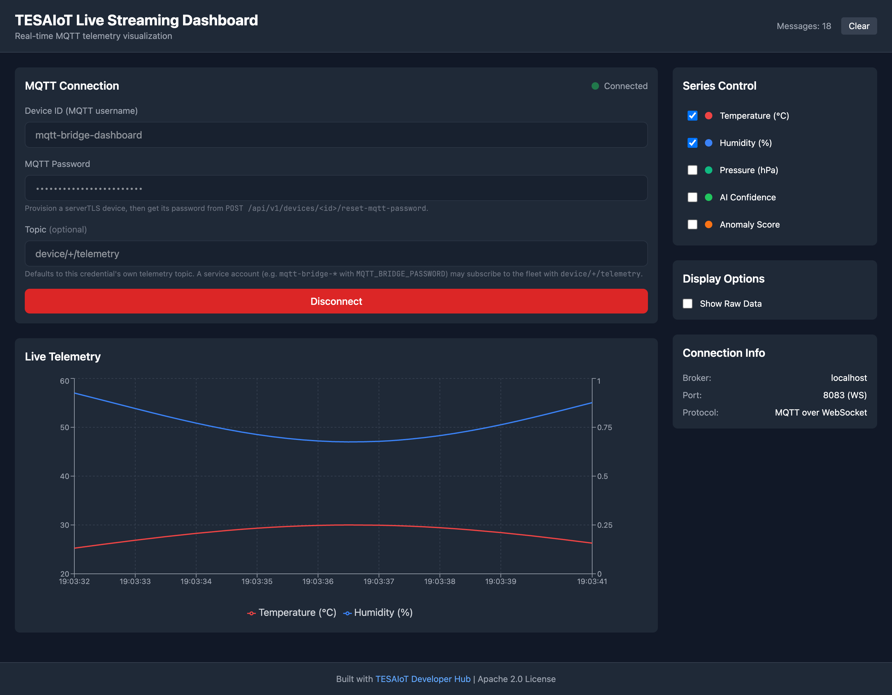
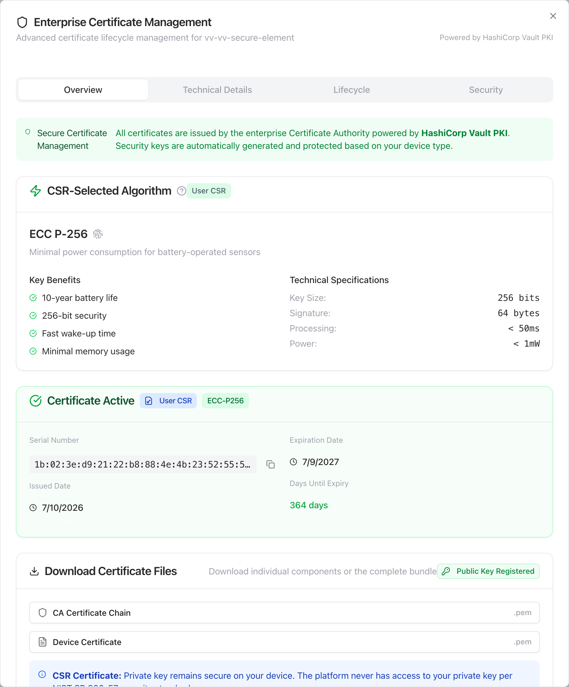
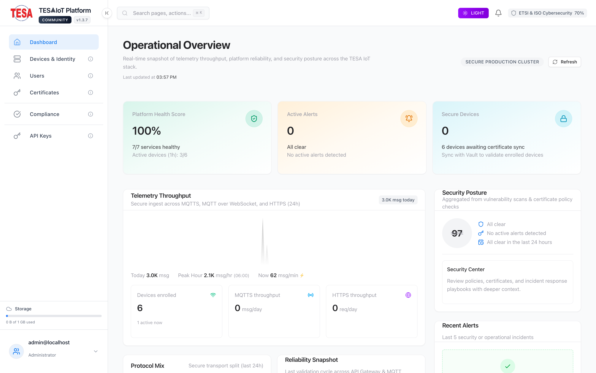
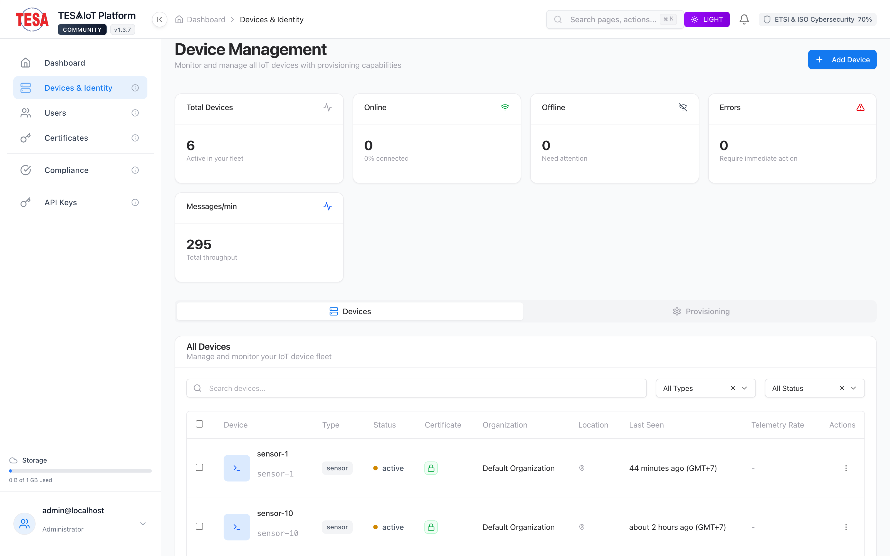

<!--
SPDX-License-Identifier: Apache-2.0
Copyright TESAIoT Platform contributors
-->

# TESAIoT Community Edition — Examples

Working examples for connecting devices and applications to a **Community Edition**
install. These are a **selective port** of the cloud
[developer-hub examples](https://github.com/tesaiot/developer-hub/tree/main/examples):
the cloud examples target features that CE ships (serverTLS/mTLS devices, MQTT, REST
telemetry) **and** features CE deliberately excludes (analytics/AI, OTA, SSO, WSS/B2B,
Grafana, MQTT-over-QUIC). Only the examples that map to a real CE capability are ported
here, and each is adapted to CE endpoints and auth.

> **Acceptance bar:** an example is only published here once it has been demonstrated
> working against a **running CE instance** (real connect + telemetry landing in
> TimescaleDB / Device Details). Analysis-only candidates stay in the plan below until
> they clear that bar.

## Before you start

Everything below assumes **your own** install. There is no hosted service in the
loop: the address is whatever `install.sh` printed when it finished, which on a
stock install is `https://localhost`. A stock install also serves its own
private-PKI certificate, so `curl` needs `-k` and browsers will warn once.

Each example is run the same way: register a device, collect the credentials it
needs, point the example at your install, run it, then confirm the data arrived.
That last step matters — an example that prints "sent" has not proved anything.

### 1. Register a device and collect its credentials

```bash
BASE=https://localhost                       # your install
TOKEN=$(curl -sk -X POST $BASE/api/v1/auth/login \
  -H 'Content-Type: application/json' \
  -d "{\"email\":\"$ADMIN_EMAIL\",\"password\":\"$ADMIN_PASSWORD\"}" \
  | python3 -c 'import json,sys; print(json.load(sys.stdin)["token"])')

# auth_mode: server_tls for username/password, mtls for a client certificate
curl -sk -X POST $BASE/api/v1/devices -H "Authorization: Bearer $TOKEN" \
  -H 'Content-Type: application/json' \
  -d '{"device_id":"my-device","name":"my-device","device_type":"sensor","auth_mode":"server_tls"}'

# MQTT password (serverTLS) — shown once
curl -sk -X POST $BASE/api/v1/devices/my-device/reset-mqtt-password \
  -H "Authorization: Bearer $TOKEN"

# device API key (REST ingest, and the MQTT password on the mTLS listener)
curl -sk -X POST $BASE/api/v1/devices/my-device/regenerate-api-key \
  -H "Authorization: Bearer $TOKEN"
```

`ADMIN_EMAIL` and `ADMIN_PASSWORD` are in the `.env` at the root of your install.

For an mTLS device, download its certificate bundle:

```bash
curl -sk -o my-device.zip -H "Authorization: Bearer $TOKEN" \
  $BASE/api/v1/certificates/devices/my-device/certificate/download/bundle
```

The bundle contains `<device_id>.pem`, `<device_id>.key`, `ca-chain.pem`,
`endpoints.json` and a rendered `mqtt_client_config.h`. Each example's own
README says which of those it reads and under what name — they are **not**
always the names in the zip.

### 2. Know which port to use

| Listener | Port | Credential |
|---|---|---|
| MQTT over TLS (serverTLS) | 8884 | device id + MQTT password |
| MQTT over mutual TLS | 8883 | client certificate **and** device id + API key as the password |
| MQTT over WebSocket | 8083 | device id + MQTT password |
| REST ingest / reads | 443 | device API key for ingest, JWT for reads |

Two things surprise people here. On the **mTLS** listener the broker still wants
a username and a non-empty password — the device id and its API key — and
rejects an empty one with `bad_username_or_password` *after* a successful TLS
handshake, which reads like a certificate fault but is not. And the MQTT
**client id must equal the device id**: Community Edition's ACL keys off it, so
a client id of `my-app-1` on a device called `my-device` is refused.

### 3. Confirm the data actually landed

```bash
# from the install directory
docker compose exec -e PGPASSWORD="$POSTGRES_PASSWORD" timescaledb \
  psql -U postgres -d tesa_telemetry \
  -c "select time, device_id, metric_name, metric_value
        from device_telemetry where device_id='my-device'
       order by time desc limit 10;"
```

If rows appear, the path worked end to end: device → broker → bridge →
TimescaleDB. If the example printed success and this is empty, trust this.

## Which examples run where

| Example | Language | What it needs | Verified |
|---|---|---|---|
| `embedded-devices/rpi-servertls` | Python | `pip install -r requirements.txt` | MQTT and HTTPS modes |
| `embedded-devices/device-servertls` | C | `make servertls` (OpenSSL) | serverTLS MQTT |
| `embedded-devices/device-mtls` | C | `make mtls` (OpenSSL) | mutual TLS MQTT |
| `embedded-devices/esp32-servertls` | firmware | ESP-IDF | contract only, not run here |
| `integrations/mqtt-telemetry-simulator` | Python | `pip install -r requirements.txt` | serverTLS MQTT |
| `security/secure-element-mtls` | Python | `pip install -r requirements.txt` | CSR → Vault → mTLS publish |
| `applications/react-telemetry-dashboard` | Node | `npm install` | build, tests, live read |
| `applications/live-streaming-dashboard` | Node | `npm install` | build, tests |
| `applications/nodered-integration` | Node | `npm install && npm run build` | build |
| `integrations/n8n-automation` | n8n | import the workflows | not run here |

The two browser dashboards read through the Vite dev-server proxy rather than
calling the API directly: Community Edition answers a CORS preflight without an
`access-control-allow-origin` header, so a direct cross-origin call from
`npm run dev` is blocked by the browser. Point `VITE_DEV_PROXY_TARGET` at your
install and leave the client on the same origin.

## Snapshots (real data)

Every snapshot below is **real data captured after running the example against a live
Community Edition install** — the actual telemetry each example published, and the actual
Vault-issued certificates the mTLS examples enrolled.

### Per-example telemetry — the data each example published

| Example | What it published | Snapshot |
|---|---|---|
| `rpi-servertls` (Python, serverTLS MQTT) | temperature / humidity / pressure |  |
| `device-servertls` (C / Mongoose, serverTLS) | temperature / humidity |  |
| `esp32-servertls` (firmware contract) | temperature / humidity |  |
| `mqtt-telemetry-simulator` (Python) | continuous sensor stream |  |

### Dashboard applications — charting real CE data

| Example | What it shows | Snapshot |
|---|---|---|
| `react-telemetry-dashboard` (React + recharts) | historical telemetry fetched over the CE REST API (JWT) |  |
| `live-streaming-dashboard` (React + MQTT-over-WS) | a real device's stream, charted live via EMQX `:8083` |  |

### Per-example certificate — the Vault PKI cert each mTLS example enrolled

| Example | What it enrolled | Snapshot |
|---|---|---|
| `device-mtls` (C, mTLS) | ECC P-256 client cert via CSR → Vault PKI |  |
| `secure-element-mtls` (OPTIGA/PSE84 sim) | on-chip key + CSR → Vault-signed cert |  |

### Platform view — all examples' telemetry, live

Operational Dashboard: secure ingest across MQTTS / MQTT-over-WS / HTTPS — the throughput
is the traffic generated by the examples above.



Device Management: the serverTLS / mTLS devices the examples provisioned, with certificate
status and per-device telemetry rate.



## The 8 capabilities an example may use

User management · Device/identity management · serverTLS & mTLS · Vault PKI certificate
lifecycle · APISIX API gateway (key-auth) · EMQX MQTT broker · MongoDB + TimescaleDB ·
IoT telemetry dashboard. Anything outside this set (analytics, AI inference, OTA, SSO,
WSS/B2B, Grafana/Prometheus, multi-tenancy) is **not** part of CE.

## Available now

Runnable units were exercised against a live Community Edition install; device telemetry
was confirmed landing in the `device_telemetry` TimescaleDB hypertable.

| Example | Path | CE capabilities | Status |
|---|---|---|---|
| serverTLS device client (Python) | [`embedded-devices/rpi-servertls`](embedded-devices/rpi-servertls) | #3 #5 #6 #7 #8 | ✅ **verified end-to-end** — MQTT (serverTLS 8884) + REST (`/api/v1/telemetry`, strict TLS) |
| serverTLS device client (C / Mongoose) | [`embedded-devices/device-servertls`](embedded-devices/device-servertls) | #3 #5 #6 #7 #8 | ✅ **verified end-to-end** — builds with OpenSSL 3; MQTTS + HTTPS both land |
| mTLS device client (C / Mongoose) | [`embedded-devices/device-mtls`](embedded-devices/device-mtls) | #3 #4 #6 #7 #8 | ✅ **verified end-to-end** — Vault CSR-enrolled cert, mTLS publish lands |
| shared C library (Mongoose transport) | [`embedded-devices/common-c`](embedded-devices/common-c) | dependency | ✅ builds + links into the C examples |
| ESP32 serverTLS firmware | [`embedded-devices/esp32-servertls`](embedded-devices/esp32-servertls) | #3 #6 #8 | ✅ **contract verified** — its exact topic/payload/serverTLS auth reproduced on a host simulator and confirmed landing (needs ESP32 hardware to flash) |
| MQTT telemetry simulator (Python) | [`integrations/mqtt-telemetry-simulator`](integrations/mqtt-telemetry-simulator) | #6 #7 #8 | ✅ **verified end-to-end** — continuous serverTLS stream lands |
| n8n workflows | [`integrations/n8n-automation`](integrations/n8n-automation) | #2 #7 #8 | ◻ CE-adapted JSON (import into your n8n; JWT wiring documented) |
| Secure-element mTLS (OPTIGA/PSE84 sim) | [`security/secure-element-mtls`](security/secure-element-mtls) | #2 #3 #4 #6 #8 | ✅ **verified end-to-end** — on-chip-style keygen + CSR → Vault cert → mTLS publish lands |
| NCSA / EN 303 645 mapping | [`security/ncsa`](security/ncsa) | docs | ✅ CE-scoped documentation |
| React telemetry dashboard | [`applications/react-telemetry-dashboard`](applications/react-telemetry-dashboard) | #1 #7 #8 | ✅ **verified** — JWT login + CE endpoints; recharts chart renders real data |
| Live streaming dashboard | [`applications/live-streaming-dashboard`](applications/live-streaming-dashboard) | #6 #8 | ✅ **verified live** — charts a real device stream over MQTT-over-WS `:8083` |
| Node-RED custom nodes | [`applications/nodered-integration`](applications/nodered-integration) | #2 #5 #8 | ◻ CE-adapted source (missing upstream client restored; run in your Node-RED) |

### mTLS device auth — verified at the platform level

The mTLS path (EMQX `:8883`, client certificate from Vault PKI) was proven end-to-end
by simulating a secure element: an on-host EC keypair + CSR (as an OPTIGA/PSE84 chip
would generate on-chip) was signed through CE's own
`POST /api/v1/certificates/devices/{id}/certificate/sign-csr`, then used to publish over
mTLS — telemetry landed. **Critical CE adaptation:** an mTLS client must still send an
MQTT **username = device_id and a non-empty password** (its device API key) — CE's EMQX
runs a `password_based` webhook authenticator, so a certificate-only connection with an
empty password is rejected *before* the webhook validates the cert CN. This is why
`pse84_tesaiot_client` sets `MQTT_PASSWORD = API_KEY`; the `device-mtls` C example (which
sends `username=NULL, password=NULL`) must be adapted the same way. See
`TESAIoT_PLAN/examples-vv-evidence.md` §6.

## Porting status of all 24 developer-hub units

Full analysis, per-unit required changes, and the phased plan live in
[`TESAIoT_PLAN/examples-ce-compatibility-triage.md`](../TESAIoT_PLAN/examples-ce-compatibility-triage.md).
Runtime evidence lives in
[`TESAIoT_PLAN/examples-vv-evidence.md`](../TESAIoT_PLAN/examples-vv-evidence.md).

### Ported / planned (13 map to CE with adaptation)

| Unit | Maps to | Effort | Notes |
|---|---|---|---|
| `emb-rpi-servertls` | serverTLS MQTT + REST | low | **Published & verified** (this repo) |
| `emb-device-servertls` (C) | serverTLS MQTT + REST | low | fix HTTPS CA-trust (`ca_chain=NULL`), repoint host |
| `emb-esp32-servertls` | serverTLS MQTT | low | CE CA into `ca_cert.h`; needs hardware |
| `emb-device-mtls` (C) | mTLS | medium | fix CA-trust; EMQX `8883` not host-mapped |
| `shared-common` (C lib) | dependency | low | trim cloud/QUIC refs; used by the C examples |
| `int-edge-ai-device-simulator` | MQTT telemetry | medium | add TLS + username/password (currently plain 1883) |
| `emb-python-cli` | REST | high | add JWT login for reads; drop `/external`, `/ws/telemetry` |
| `app-react-dashboard` | REST telemetry | medium | rewrite endpoints; remove committed API key |
| `app-live-streaming-dashboard` | MQTT-over-WS | medium | broker → `ws://localhost:8083`; drop `tesa_mqtt_` token auth |
| `app-nodered-integration` | REST | high | restore missing `client.ts`; JWT reads; remove WSS node |
| `int-n8n-automation` | REST | medium | re-architect anomaly-webhook alert to schedule-poll |
| `sec-ncsa` | docs | low | strip excluded-feature sections; fix symlinks |
| `sec-pse84-client` (HW) | mTLS | medium | HW; menu-3 cert-renewal gated on CE |

`sec-rpi-client` (HW secure-element) is **copy-with-caveat**: CSR-over-MQTT enrollment
and Protected Update have no server-side answer in stock CE.

### Not ported (10 depend on an excluded feature — do **not** copy)

`analytics-api`, `int-ai-service-template` (AI/analytics) · `app-grafana-dashboard`
(Grafana) · `emb-c_ota_client` (OTA) · `emb-mqtt-quic-advanced`, `emb-mqtt-quic-python`,
`int-mqtt-quic-c` (MQTT-over-QUIC) · `app-wss-mqtt-streaming`, `int-wss-live-streaming`
(WSS/B2B + org MQTT tokens) · `sec-identity-sso` (Keycloak OIDC).

## Shared adaptation rules (when porting the rest)

1. Endpoints → `localhost` (API `https://localhost`, MQTT serverTLS `:8884`, mTLS `:8883`,
   WS `:8083`).
2. Drop the `/api/v1/external` prefix — CE has no `external` blueprint.
3. Auth boundary: `X-API-KEY` authorizes **telemetry ingest only**; device/dashboard
   reads are JWT-only (`POST /api/v1/auth/login`).
4. Use the CE Vault-PKI CA (`config/tls/ca-bundle.pem`); never ship `verify=False` /
   `CERT_NONE` / `ca_chain=NULL` / `rejectUnauthorized:false`.
5. Remove excluded-feature code (analytics/AI, OTA, WSS/`tesa_mqtt_` tokens, QUIC,
   Keycloak, Grafana) and all `organization_id` (CE is single-org).
6. MQTT topic `device/<id>/telemetry`; strip committed secrets; fix stale port/auth docs.
